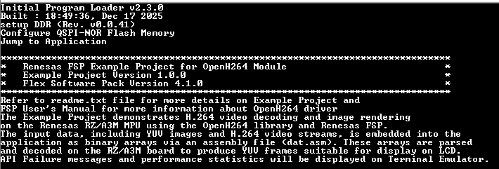
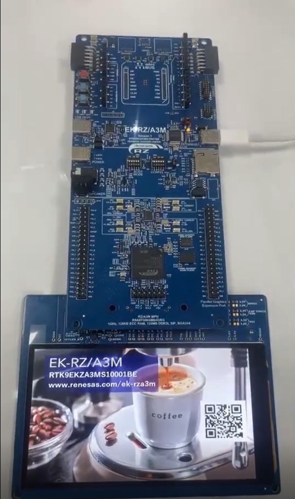
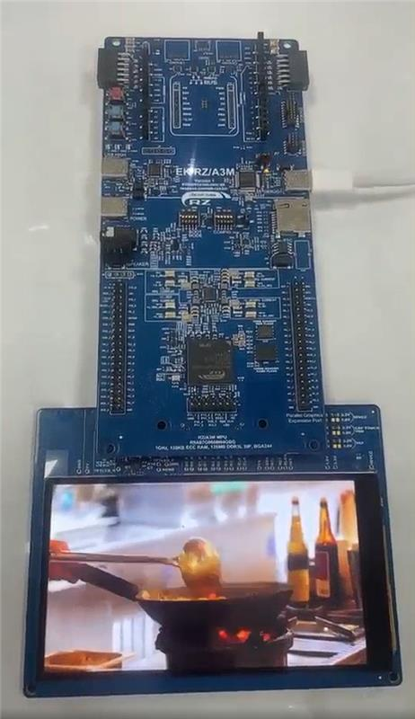
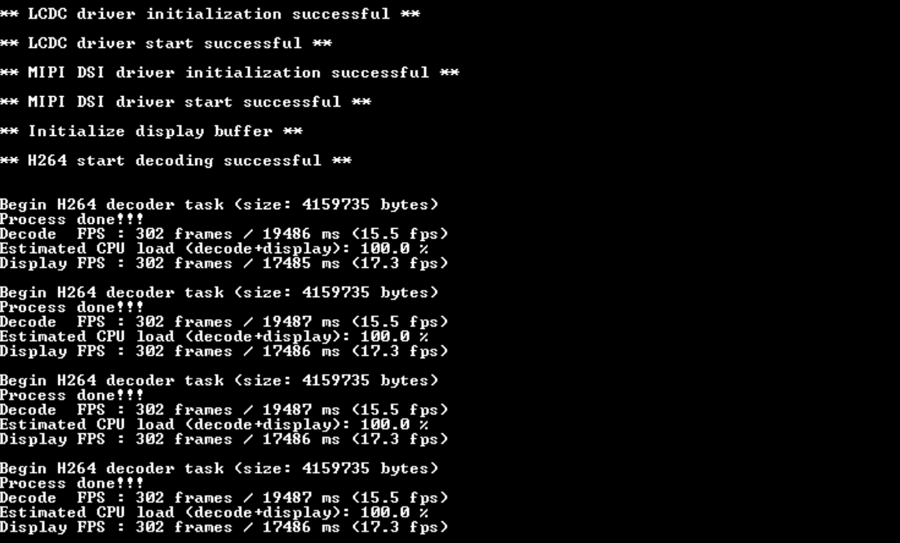
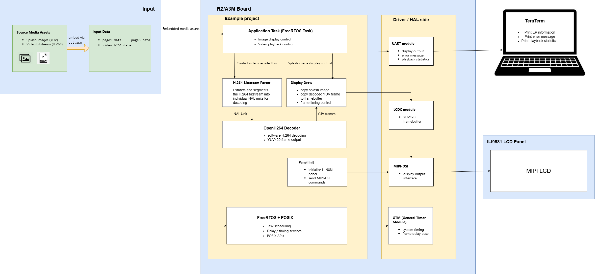
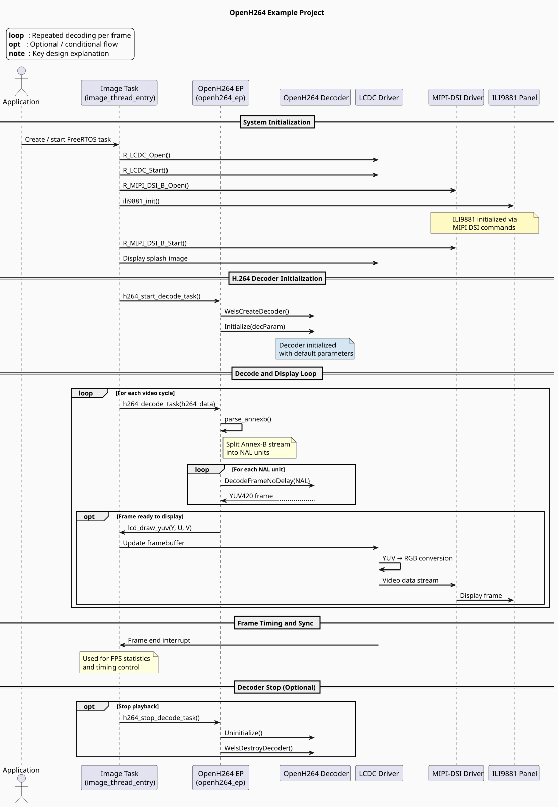
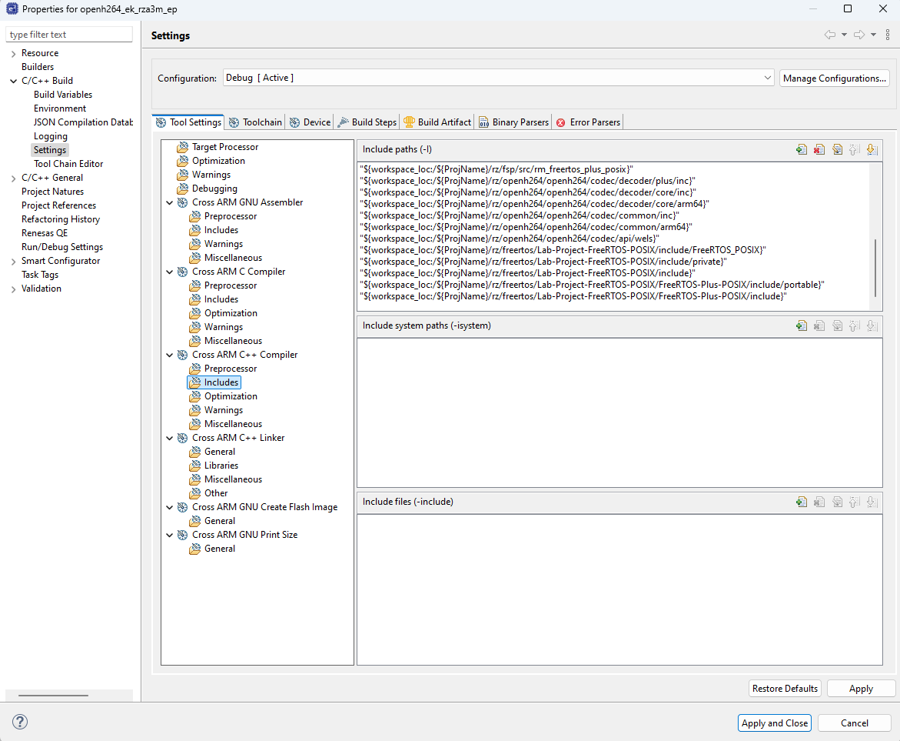
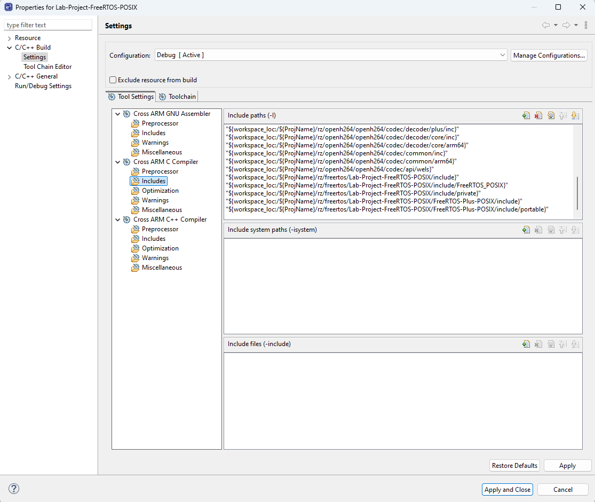

# OpenH264 Example Project on RZ Boards

## Table of Contents
1. [Introduction](#introduction)
    1. [Supported Boards](#supported-boards)
2. [Required Resources](#required-resources)
    1. [Hardware Requirements](#hardware-requirements)
        1. [Common Hardware](#common-hardware)
        2. [Additional Hardware](#additional-hardware)
        3. [Hardware Connections](#hardware-connections)
    2. [Software Requirements](#software-requirements)
3. [Application Execution](#application-execution)
4. [Project Notes](#project-notes)
    1. [System-Level Block Diagram](#system-level-block-diagram)
    2. [FSP Modules Used](#fsp-modules-used)
    3. [Module Configuration Notes](#module-configuration-notes)
    4. [API Usage](#api-usage)
    5. [Memory Usage](#memory-usage)
    6. [Clock Configuration](#clock-configuration)
    7. [Application Execution Flow](#application-execution-flow)
    8. [Troubleshooting Tips](#troubleshooting-tips)
    9. [Known Limitations](#known-limitations)
5. [Special Topics](#special-topics)
6. [Conclusion and Next Steps](#conclusion-and-next-steps)
7. [References](#references)
8. [Notice](#notice)

## Introduction

The OpenH264 project demonstrates H.264 video decoding and real-time display capabilities on the Renesas RZ MPUs using the OpenH264 library and Renesas FSP. The project showcases:

- H.264 video stream decoding using OpenH264 software decoder
- MIPI-DSI display output via ILI9881 LCD controller
- YUV420 to RGB conversion and frame buffering using LCDC
- FreeRTOS-based multithreading for video playback control
- Real-time performance monitoring with frame timing statistics

The input data, including YUV splash images and H.264 video streams, is embedded into the application as binary arrays via an assembly file (`dat.asm`). These arrays are parsed and decoded on the RZ board to produce YUV420 frames suitable for display on the MIPI-DSI LCD panel.

Please refer to the [Example Project Usage Guide](https://github.com/renesas/rz-fsp-examples/blob/main/example_projects/Example%20Project%20Usage%20Guide.pdf) for general information on example projects.

### Supported Boards

| #  | Board | MPU | J-Link OB VCOM | SEGGER_RTT Address | Board-Specific Guide |
|----|-------|-----|----------------|--------------------|----------------------|
| 1  | EK-RZA3M   | R9A07G066M04GBG | ☑ | N/A | [EK-RZA3M Guide](openh264_board_specific_notes.md#ekrza3m--board-specific-guide) |
...

 

**Note:**
* Boards marked with ☑ under **J-Link OB VCOM** support the J-Link On-Board Virtual COM Port (VCOM).

## Required Resources
To build and run the Open H264 example project, the following resources are needed.

### Hardware Requirements

#### Common Hardware
* 1 × Supported RZA board (Refer to [Supported Boards](#supported-boards) section).
* 1 x USB cable for programming and debugging (USB cable type varies by board model).
* 1 x MIPI Graphics Expansion Board.

#### Additional Hardware
* Detailed **Additional Hardware** for each supported board is described in the [Board-Specific Guide](#supported-boards).

#### Hardware Connections
* Detailed **Specific Connections** for each supported board is described in the [Board-Specific Guide](#supported-boards).
* Common Connections:
    * After completing board-specific hardware connections, connect the RZA board's USB debug port to the host PC using the appropriate USB cable.

### Software Requirements
* Renesas Flexible Software Package (FSP): Version 4.2.0
* e2 studio: Version 2026-07
* GCC ARM A-Profile (AArch64 bare-metal): Version 13.2 rel1
* Terminal Console Application: Tera Term or a similar application

**Note:** Refer to the [FSP version requirements](https://github.com/renesas/rz-fsp-examples/blob/main/example_projects/version_info_table.md) table per IDE to correctly download the needed [FSP release](https://github.com/renesas/rz-fsp/releases).

## Application Execution
1. Import, generate, and build the example project.
   Before running the example project, make sure hardware connections are done.
2. Download Open H.264 EP to one Renesas RZ MPU Evaluation kit and run the project.
3. Open a serial terminal application (e.g., Tera Term) on the host PC and connect to the board's UART port. The configuration parameters of the serial port on the serial terminal application are as follows:
    * Speed: 115200
    * Data: 8 bit
    * Parity: none
    * Stop bits: 1 bit
    * Flow control: none
4. Power-cycle the RZ board.
5. Observe the console output showing initialization messages and video decode statistics.
6. Verify video playback on the MIPI-DSI LCD display:
   - Splash screen displays briefly before video starts
   - H.264 video plays smoothly at approximately 20 fps
   - Video loops continuously with short pause between cycles
7. Verify decode statistics on Tera Term console:
   - Console shows decode statistics: frame count, total time, and actual fps

### Execution Output

**Note:** Execution results may vary depending on the supported features and hardware capabilities of each board.

   The following example shows the execution output on the EK-RZA3M board:

+ Banner Info:

   

+ LCD: Splash Screen Display:

   

   *LCD displaying splash image before video playback starts*

+ LCD: Video Playback:

   

   *LCD showing decoded H.264 video frame during playback*

+ Console: Decoder Statistics:

   

   *Console showing decode completion with frame count and fps after one cycle*

## Project Notes

### System-Level Block Diagram

### FSP Modules Used

List of important modules that are used in this example project. Refer to the FSP User Manual for further details on each module listed below.

| Module Name | Usage | Searchable Keyword |
|-------------|-------|-------------------|
| LCD Controller | Manages framebuffer, performs YUV to RGB conversion, and outputs video timing signals | lcdc |
| MIPI-DSI Controller | Transmits RGB pixel data to LCD panel via 4-lane MIPI-DSI interface | mipi_dsi |
| MIPI Physical Layer | Configures D-PHY parameters for MIPI-DSI high-speed transmission | mipi_phy |
| UART | Provides console output for debug messages and performance statistics | scif_uart |
| OpenH264 | Software-based H.264/AVC codec library for encoding and decoding video and image | openh264 |
| FreeRTOS | Real-time operating system for task scheduling and timing control | freertos |

 

### Module Configuration Notes

This section describes FSP Configurator properties which are important or different from those selected by default.

Configuration Properties for Display driver — `g_display` instance  
Path: `configuration.xml > Stacks > g_display Display driver > Properties`

|   Module Property Path and Identifier   |   Default Value   |   Used Value   |   Reason   |
| :-------------------------------------: | :---------------: | :------------: | :--------: |
|  Interrupts > Callback Function | NULL | disp_buf_change | A callback function is required to handle the LCDC frame end event for display synchronization |
|  Input > Graphics Layer 1  > General > Horizontal size | 1280 | 720 | Horizontal pixel value of LCD used for RZ MPU is 720 |
|  Input > Graphics Layer 1  > General > Vertical size | 720 | 1280 | Vertical pixel value of LCD used for RZ MPU is 1280 |
|  Input > Graphics Layer 1  > General > Color format | YCbCr422 interleaved YUYV(16 bit) | YCbCr420 Planar (16-bit) | OpenH264 decoder outputs YUV420 planar format with separate Y, U, V planes, which matches directly with the LCDC framebuffer layout |
|  Input > Graphics Layer 1  > General > 64bit swap | Disabled | Enabled | Perform a full 64-bit endian reversal, correcting the byte-order mismatch between the little-endian writing YCbCr420 Planar framebuffer data and the LCDC hardware reading it over the 64-bit DDR bus. |
|  Input > Graphics Layer 1  > General > 32bit swap | Disabled | Enabled | Perform a full 64-bit endian reversal, correcting the byte-order mismatch between the little-endian writing YCbCr420 Planar framebuffer data and the LCDC hardware reading it over the 64-bit DDR bus. |
|  Input > Graphics Layer 1  > General > 16bit swap | Disabled | Enabled | Perform a full 64-bit endian reversal, correcting the byte-order mismatch between the little-endian writing YCbCr420 Planar framebuffer data and the LCDC hardware reading it over the 64-bit DDR bus. |
|  Input > Graphics Layer 1  > General > 8bit swap | Disabled | Enabled | Perform a full 64-bit endian reversal, correcting the byte-order mismatch between the little-endian writing YCbCr420 Planar framebuffer data and the LCDC hardware reading it over the 64-bit DDR bus. |
|  Input > Graphics Layer 1  > Framebuffer > Framebuffer name | fb_background | fb_foreground | Semantically identify this buffer as the active display layer carrying decoded YCbCr420 video frames, and to match the symbol referenced throughout the application code |
|  Input > Graphics Layer 1  > Framebuffer > Number of buffers | 1 | 2 | Enable double buffering, allowing one buffer to be displayed while the other is being written with the next decoded YCbCr420 frame. |
|  Output > Timing  > Horizontal Total Cycles  |   1650   |   953  |   Typical value for horizontal period time for parallel RGB input as per LCD datasheet  |
|  Output > Timing  > Horizontal active video cycles  |   1280   |   720  |  Horizontal display area per LCD datasheet |
|  Output > Timing  > Horizontal back porch cycles  |   260   |   100  |   Typical value of number of HSD back porch cycles for parallel RGB input as per LCD datasheet |
|  Output > Timing  > Horizontal sync signal cycles |   40   |   33  |   Typical value of number of Hsync signal assertion cycles |
|  Output > Timing  > Horizontal sync signal polarity |   High Active   |   High Active  |   Hsync polarity is active high as per LCD datasheet |
|  Output > Timing  > Vertical total lines |   750   |   1332  |   Typical value of total lines in a frame |
|  Output > Timing  > Vertical active video lines |   720   |   1280  |   Vertical display area per LCD datasheet |
|  Output > Timing > Vertical back porch lines |   25   |   30  |  Typical value of number of VSD back porch cycles for parallel RGB input as per LCD datasheet |
|  Output > Timing > Vertical sync signal lines |   5   |   2  | Typical value of Vsync signal assertion line |
|  Output > Timing > Vertical sync signal polarity |  High active | High active | VSD polarity control bit is high active by default as per LCD datasheet |
|  Output > Timing > Data Enable Signal Polarity | High active | High active | DE polarity is active high by default as per LCD datasheet |
|  Output > Timing > Sync edge | Falling edge | Rising edge | Sync signal is rising edge for LCD |

 

### API Usage
The links below list the FSP-provided APIs that may be used at the application layer.

* [LCD Controller Module APIs on FSP User Manual on GitHub](https://renesas.github.io/rz-fsp/group___r_z_a___l_c_d_c.html)
* [MIPI Display Serial Interface Module APIs on FSP User Manual on GitHub](https://renesas.github.io/rz-fsp/group___r_z_a___m_i_p_i___d_s_i___b.html)
* [OpenH264 APIs on FSP User Manual on GitHub](https://renesas.github.io/rz-fsp/group___r_z_a___r_m___o_p_e_n_h264___p_o_r_t.html)

### Memory Usage
Memory usage varies depending on the target board, compiler, linker script,
and enabled system components (display drivers, frame buffers, embedded data).

**Reference Measurements:**

Measured using **Memory Usage view in e² studio** with the following conditions:
- Target: RZ/A3M
- Compiler: GCC
- Build: Debug
- Display enabled (LCDC + MIPI-DSI)
- Embedded H.264 stream and YUV frame buffers

 
| Item                | Approximate Size |
|---------------------|------------------|
| Program / ROM Usage | ~11.1 MB         |
| RAM Usage (linked allocation across used memory regions) | ~161 MB |

 
 
**Notes:**

* Program / ROM usage is relatively high because the application includes the OpenH264 decoder, display-related software components, and embedded binary assets such as splash images and H.264 stream data stored via `dat.asm`.
* RAM usage is also high because the application allocates large frame buffers and decoder working memory in external RAM.
* The exact RAM figure depends on which memory regions are counted (for example, uncached RAM, cached RAM, code RAM, stack, and linker-allocated sections).

**Memory Analysis:**

For detailed memory usage breakdown, refer to the build output (e.g., .map file) or use the Memory Usage view in e² studio.

**Accessing Memory Usage View in e² studio:**

* Navigate to:

        Renesas Views -> C/C++ -> Memory Usage
 
* Then select the target project in the Project Explorer to display memory details.

### Clock Configuration

If the clock configuration deviates from the default or requires special handling for specific EPs, those details will be documented here to support EP demonstration. However, for the OpenH264 EP, no special clock adjustments are necessary.

### Application Execution Flow
This section describes the sequence of events and usage of APIs during the execution flow of the application. The diagram shows the OpenH264 operation flow:

### Troubleshooting Tips
None.

### Known Limitations
None.

## Special Topics

### Pre-build Configuration
#### Background
The following compiler include path settings have already been configured in the project and should be verified in e² studio before building to ensure the build environment is correctly set up on the local machine.

#### Steps
##### Step 1: Verify FreeRTOS-POSIX Paths to C++ Compiler
   - Open Project Properties → C/C++ Build → Settings.

   - Navigate to Tool Settings → Cross ARM C++ Compiler → Includes.

   - Verify the following paths are present under **Include paths (-I)**:

    - "${workspace_loc:/${ProjName}/rz/freertos/Lab-Project-FreeRTOS-POSIX/include}"
    - "${workspace_loc:/${ProjName}/rz/freertos/Lab-Project-FreeRTOS-POSIX/include/FreeRTOS_POSIX}"
    - "${workspace_loc:/${ProjName}/rz/freertos/Lab-Project-FreeRTOS-POSIX/include/private}"
    - "${workspace_loc:/${ProjName}/rz/freertos/Lab-Project-FreeRTOS-POSIX/FreeRTOS-Plus-POSIX/include}"
    - "${workspace_loc:/${ProjName}/rz/freertos/Lab-Project-FreeRTOS-POSIX/FreeRTOS-Plus-POSIX/include/portable}"

 

##### Step 2: Verify Folder-Specific Settings for FreeRTOS-POSIX Source
   - In the Project Explorer, right-click the folder: 'rz/freertos/Lab-Project-FreeRTOS-POSIX'

   - Select Properties → C/C++ Build → Settings.

   - Navigate to Tool Settings → Cross ARM C Compiler → Includes.

   - Verify the same 5 paths above are present under **Include paths (-I)**.

   

## Conclusion and Next Steps
* To further explore Openh264 implementation on Renesas RZA MPUs:
    * Review the project source code located in the src directory.
    * Refer to the HAL driver and its documentation in the FSP User Manual for deeper technical insights.
    * Visit renesas.com for additional OpenH264 resources, application notes, and documentation related to RZA devices.

## References
The following documents provide general reference and background information.

* [FSP User Manual on GitHub](https://renesas.github.io/rz-fsp)

## Notice

1. Descriptions of circuits, software and other related
information in this document are provided only to illustrate the
operation of semiconductor products and application examples. You are
fully responsible for the incorporation or any other use of the
circuits, software, and information in the design of your product or
system. Renesas Electronics disclaims any and all liability for any
losses and damages incurred by you or third parties arising from the use
of these circuits, software, or information. 

2. Renesas Electronics
hereby expressly disclaims any warranties against and liability for
infringement or any other claims involving patents, copyrights, or other
intellectual property rights of third parties, by or arising from the
use of Renesas Electronics products or technical information described
in this document, including but not limited to, the product data,
drawings, charts, programs, algorithms, and application examples. 

3. No license, express, implied or otherwise, is granted hereby under any
patents, copyrights or other intellectual property rights of Renesas
Electronics or others. 

4. You shall be responsible for determining what
licenses are required from any third parties, and obtaining such
licenses for the lawful import, export, manufacture, sales, utilization,
distribution or other disposal of any products incorporating Renesas
Electronics products, if required. 

5. You shall not alter, modify, copy,
or reverse engineer any Renesas Electronics product, whether in whole or
in part. Renesas Electronics disclaims any and all liability for any
losses or damages incurred by you or third parties arising from such
alteration, modification, copying or reverse engineering. 

6. Renesas Electronics products are classified according to the following two
quality grades: "Standard" and "High Quality". The intended applications
for each Renesas Electronics product depends on the product's quality
grade, as indicated below. "Standard": Computers; office equipment;
communications equipment; test and measurement equipment; audio and
visual equipment; home electronic appliances; machine tools; personal
electronic equipment; industrial robots; etc. "High Quality":
Transportation equipment (automobiles, trains, ships, etc.); traffic
control (traffic lights); large-scale communication equipment; key
financial terminal systems; safety control equipment; etc. Unless
expressly designated as a high reliability product or a product for
harsh environments in a Renesas Electronics data sheet or other Renesas
Electronics document, Renesas Electronics products are not intended or
authorized for use in products or systems that may pose a direct threat
to human life or bodily injury (artificial life support devices or
systems; surgical implantations; etc.), or may cause serious property
damage (space system; undersea repeaters; nuclear power control systems;
aircraft control systems; key plant systems; military equipment; etc.).
Renesas Electronics disclaims any and all liability for any damages or
losses incurred by you or any third parties arising from the use of any
Renesas Electronics product that is inconsistent with any Renesas
Electronics data sheet, user's manual or other Renesas Electronics
document. 

7. No semiconductor product is absolutely secure. Notwithstanding any security measures or features that may be implemented in Renesas Electronics hardware or software products, Renesas Electronics shall have absolutely no liability arising out of
any vulnerability or security breach, including but not limited to any unauthorized access to or use of a Renesas Electronics product or a system that uses a Renesas Electronics product. RENESAS ELECTRONICS DOES NOT WARRANT OR GUARANTEE THAT RENESAS ELECTRONICS PRODUCTS, OR ANY
SYSTEMS CREATED USING RENESAS ELECTRONICS PRODUCTS WILL BE INVULNERABLE OR FREE FROM CORRUPTION, ATTACK, VIRUSES, INTERFERENCE, HACKING, DATA LOSS OR THEFT, OR OTHER SECURITY INTRUSION ("Vulnerability Issues"). RENESAS ELECTRONICS DISCLAIMS ANY AND ALL RESPONSIBILITY OR LIABILITY
ARISING FROM OR RELATED TO ANY VULNERABILITY ISSUES. FURTHERMORE, TO THE EXTENT PERMITTED BY APPLICABLE LAW, RENESAS ELECTRONICS DISCLAIMS ANY AND ALL WARRANTIES, EXPRESS OR IMPLIED, WITH RESPECT TO THIS DOCUMENT
AND ANY RELATED OR ACCOMPANYING SOFTWARE OR HARDWARE, INCLUDING BUT NOT LIMITED TO THE IMPLIED WARRANTIES OF MERCHANTABILITY, OR FITNESS FOR A PARTICULAR PURPOSE. 

8. When using Renesas Electronics products, refer to the latest product information (data sheets, user's manuals, application notes, "General Notes for Handling and Using Semiconductor Devices" in
the reliability handbook, etc.), and ensure that usage conditions are within the ranges specified by Renesas Electronics with respect to
maximum ratings, operating power supply voltage range, heat dissipation characteristics, installation, etc. Renesas Electronics disclaims any
and all liability for any malfunctions, failure or accident arising out of the use of Renesas Electronics products outside of such specified
ranges. 

9. Although Renesas Electronics endeavors to improve the quality and reliability of Renesas Electronics products, semiconductor products
have specific characteristics, such as the occurrence of failure at a certain rate and malfunctions under certain use conditions. Unless
designated as a high reliability product or a product for harsh environments in a Renesas Electronics data sheet or other Renesas
Electronics document, Renesas Electronics products are not subject to radiation resistance design. You are responsible for implementing safety
measures to guard against the possibility of bodily injury, injury or damage caused by fire, and/or danger to the public in the event of a
failure or malfunction of Renesas Electronics products, such as safety design for hardware and software, including but not limited to
redundancy, fire control and malfunction prevention, appropriate treatment for aging degradation or any other appropriate measures.
Because the evaluation of microcomputer software alone is very difficult and impractical, you are responsible for evaluating the safety of the
final products or systems manufactured by you. 

10. Please contact a
Renesas Electronics sales office for details as to environmental matters such as the environmental compatibility of each Renesas Electronics
product. You are responsible for carefully and sufficiently investigating applicable laws and regulations that regulate the
inclusion or use of controlled substances, including without limitation, the EU RoHS Directive, and using Renesas Electronics products in
compliance with all these applicable laws and regulations. Renesas Electronics disclaims any and all liability for damages or losses
occurring as a result of your noncompliance with applicable laws and regulations. 

11. Renesas Electronics products and technologies shall not be used for or incorporated into any products or systems whose
manufacture, use, or sale is prohibited under any applicable domestic or foreign laws or regulations. You shall comply with any applicable export
control laws and regulations promulgated and administered by the governments of any countries asserting jurisdiction over the parties or
transactions. 

12. It is the responsibility of the buyer or distributor of Renesas Electronics products, or any other party who distributes,
disposes of, or otherwise sells or transfers the product to a third party, to notify such third party in advance of the contents and
conditions set forth in this document. 

13. This document shall not be
reprinted, reproduced or duplicated in any form, in whole or in part, without prior written consent of Renesas Electronics. 

14. Please contact a Renesas Electronics sales office if you have any questions regarding the information contained in this document or Renesas Electronics
products. (Note1) "Renesas Electronics" as used in this document means Renesas Electronics Corporation and also includes its directly or
indirectly controlled subsidiaries. (Note2) "Renesas Electronics product(s)" means any product developed or manufactured by or for
Renesas Electronics.

                                                                                   (Rev.5.0-1 October 2020)
## Corporate Headquarters 

Contact information TOYOSU FORESIA, 3-2-24

Toyosu, Koto-ku, Tokyo 135-0061, Japan 

www.renesas.com 

## Contact information 

For further information on a product, technology, the most up-to-date version of a
document, or your nearest sales office, please visit:
www.renesas.com/contact/. 

## Trademarks 
Renesas and the Renesas logo are trademarks of Renesas Electronics Corporation. All trademarks and
registered trademarks are the property of their respective owners.

							© 2026 Renesas Electronics Corporation. All rights reserved
