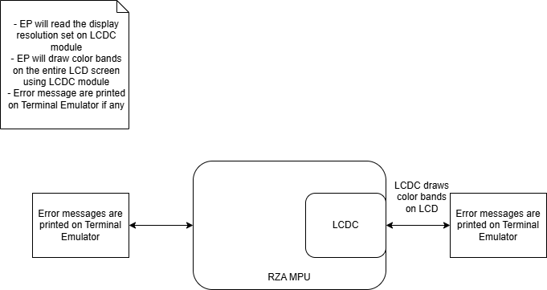
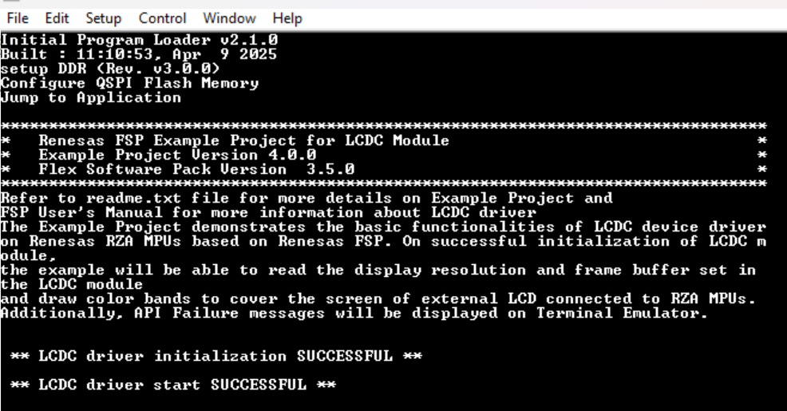
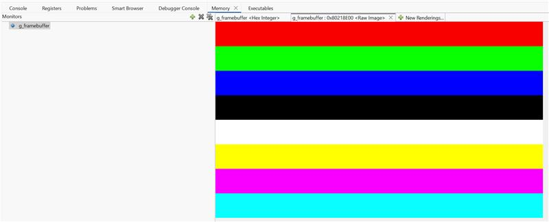
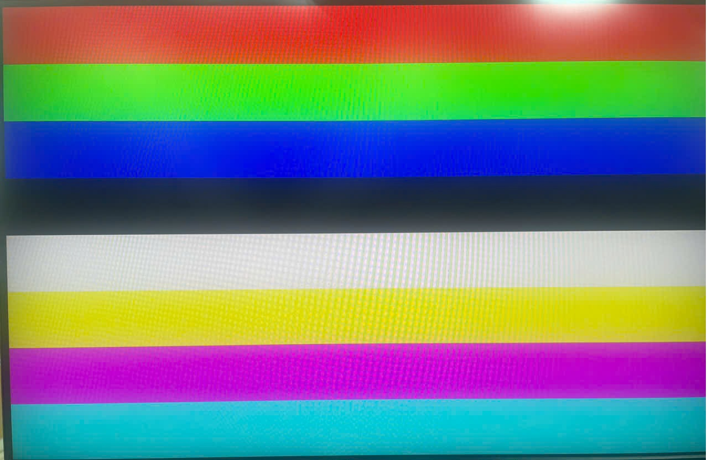

# Introduction
 
This Example Project demonstrates the basic functionalities of the LCDC device driver on Renesas RZA MPUs based on Renesas FSP. On successful initialization of the LCDC module,
the EP will read the display resolution and frame buffer set in the LCDC module and draw color bands to cover the entire screen of external LCD connected to RZA MPU.
User can view raw image in e2studio IDE. Errors and Status information will be printed on Terminal Emulator during the execution of the project.

Please refer to the Example Project Usage Guide for general information on example projects and [readme.txt](./readme.txt) for specifics of operation.

## Required Resources
To build and run the LCDC example project, the following resources are needed.

### Hardware
* Renesas RZA3UL board
* Mini HDMI to HDMI Cable
* Parallel to HDMI Conversion board
* Display support HDMI port

Refer to [readme.txt](./readme.txt) for information on how to connect the hardware.

### Software
1. Refer to the software required section in Example Project Usage Guide

## Related Collateral References
The following documents can be referred to for enhancing your understanding of 
the operation of this example project:
- [FSP User Manual on GitHub](https://renesas.github.io/rz-fsp/)

# Project Notes

## System Level Block Diagram
High level block diagram

## FSP Modules Used
List of important modules that are used in this example project. Refer to the FSP User Manual for further details on each module listed below.

| Module Name | Usage | Searchable Keyword  |
|-------------|-----------------------------------------------|-----------------------------------------------|
|LCDC | Driver for multi-stage graphics output peripheral designed to automatically generate timing and data signals for LCD panels. | lcdc|

## Module Configuration Notes
This section describes FSP Configurator properties which are important or different than those selected by default. 

|   Module Property Path and Identifier   |   Default Value   |   Used Value   |   Reason   |
| :-------------------------------------: | :---------------: | :------------: | :--------: |
|   configuration.xml -> g_display Display Driver (r_lcdc) > Settings > Property > Module  >  Input > Graphics Layer 1  > General > Enabled | Yes | Yes | Enabling this option to create framebuffer that is required for color band display |
|   configuration.xml -> g_display Display Driver (r_lcdc) > Settings > Property > Module  >  Input > Graphics Layer 1  > General > Horizontal size | 1280 | 800 | Horizontal pixel value of LCD used for RZ/A3UL is 800 |
|   configuration.xml -> g_display Display Driver (r_lcdc) > Settings > Property > Module  >  Input > Graphics Layer 1  > General > Vertical size | 720 | 480 | Vertical pixel value of LCD used for RZ/A3UL is 480 |
|   configuration.xml -> g_display Display Driver (r_lcdc) > Settings > Property > Module  >  Input > Graphics Layer 1  > General > Color format | YCbCr422 interleaved YUYV(16 bit) | RGB565(16 bit) | The LCD board is designed in RGB565 format |
|   configuration.xml -> g_display Display Driver (r_lcdc) > Settings > Property > Module  >  Input > Graphics Layer 1  > Framebuffer > Framebuffer name | fb_background | g_framebuffer | Better visualize and unify with RA GLCDC EP |
|   configuration.xml -> g_display Display Driver (r_lcdc) > Settings > Property > Module  >  Input > Graphics Layer 2  > General > Enabled | Yes | No | Disabling this option because it is not need for EP |
|   configuration.xml -> g_display Display Driver (r_lcdc) > Settings > Property > Module  >  Output > Timing  > Horizontal Total Cycles  |   1650   |   1056  |   Typical value for horizontal period time for parallel RGB input as per LCD datasheet  |
|   configuration.xml -> g_display Display Driver (r_lcdc) > Settings > Property > Module  >  Output > Timing  > Horizontal active video cycles  |   1280   |   800  |  Horizontal display area per LCD datasheet |
|   configuration.xml -> g_display Display Driver (r_lcdc) > Settings > Property > Module  >  Output > Timing  > Horizontal back porch cycles  |   260   |   216  |   Typical value of number of HSD back porch cycles for parallel RGB input as per LCD datasheet |
|   configuration.xml -> g_display Display Driver (r_lcdc) > Settings > Property > Module  >  Output > Timing  > Horizontal sync signal cycles |   40   |   128  |   Typical value of number of Hsync signal assertion cycles |
|   configuration.xml -> g_display Display Driver (r_lcdc) > Settings > Property > Module  >  Output > Timing  > Horizontal sync signal polarity |   High Active   |   High Active  |   Hsync polarity is active high as per LCD datasheet |
|   configuration.xml -> g_display Display Driver (r_lcdc) > Settings > Property > Module  >  Output > Timing  > Vertical total lines |   750   |   525  |   Typical value of total lines in a frame |
|   configuration.xml -> g_display Display Driver (r_lcdc) > Settings > Property > Module  >  Output > Timing  > Vertical active video lines |   720   |   480  |   Vertical display area per LCD datasheet |
|   configuration.xml -> g_display Display Driver (r_lcdc) > Settings > Property > Module  >  Output > Timing > Vertical back porch lines |   25   |   25  |  Typical value of number of VSD back porch cycles for parallel RGB input as per LCD datasheet |
|   configuration.xml -> g_display Display Driver (r_lcdc) > Settings > Property > Module  >  Output > Timing > Vertical sync signal lines |   5   |   4  | Typical value of Vsync signal assertion line |
|   configuration.xml -> g_display Display Driver (r_lcdc) > Settings > Property > Module  >  Output > Timing > Vertical sync signal polarity |  High active | High active | VSD polarity control bit is high active by default as per LCD datasheet |
|   configuration.xml -> g_display Display Driver (r_lcdc) > Settings > Property > Module  >  Output > Timing > Data Enable Signal Polarity | High active | High active | DE polarity is active high by default as per LCD datasheet |
|   configuration.xml -> g_display Display Driver (r_lcdc) > Settings > Property > Module  >  Output > Timing > Sync edge | Falling edge | Rising edge | Sync signal is rising edge for LCD |

The table below lists the FSP provided API used at the application layer by this example project.

| API Name    | Usage                                                                          |
|-------------|--------------------------------------------------------------------------------|
| R_LCDC_Open | This API is used to initializes the LCDC modules and enables interrupts. |
| R_LCDC_Start | This API is used start displaying a layer image. It is possible when LCDC state is open |
| R_LCDC_BufferChange | This API is used to change Buffer configuration. It is possible when LCDC state is displaying. |

## Verifying operation
Import, Build and Debug the EP(see section Starting Development of FSP User Manual). After running the EP, open the Terminal Emulator to view status or
check any error messages.
User can view the raw image in e2studio IDE using Memory Monitor. User has to add "g_framebuffer" under "Monitor" and add rendering as Raw Image.
The output can also be seen in LCD screen.
Before running the example project, refer to the below steps for hardware connections :
* Connect (CN14) on Smarc Carrier Board with PC through USB Type-microB Connector
* Connect Parallel to HDMI Conversion board to port CN5 of module board.
* Connect Mini HDMI to HDMI Cable to Parallel to HDMI Conversion board
* Connect Mini HDMI to HDMI Cable to Display support HDMI port

The below images showcase the output on Terminal Emulator, in the Memory Monitor view in e2 studio, and in Display support HDMI port respectively:

