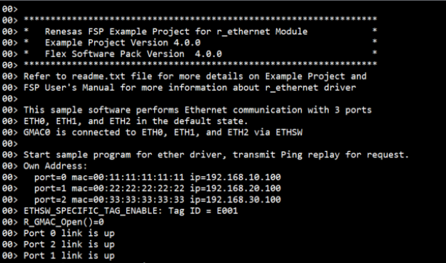
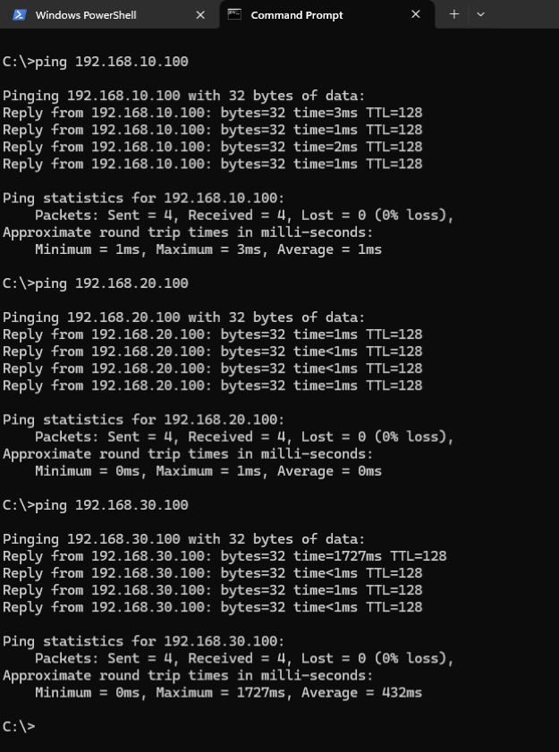
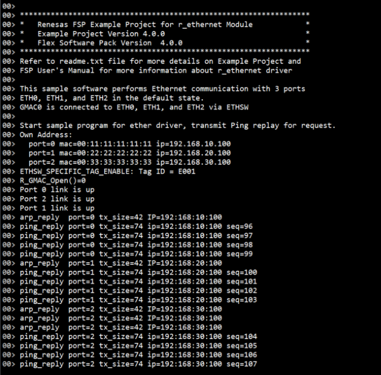
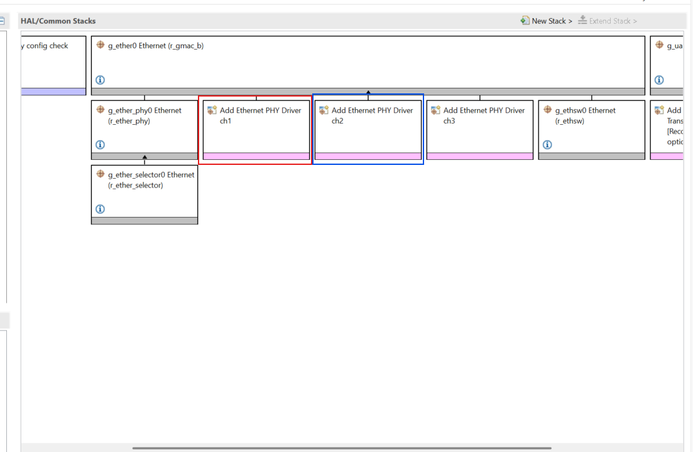
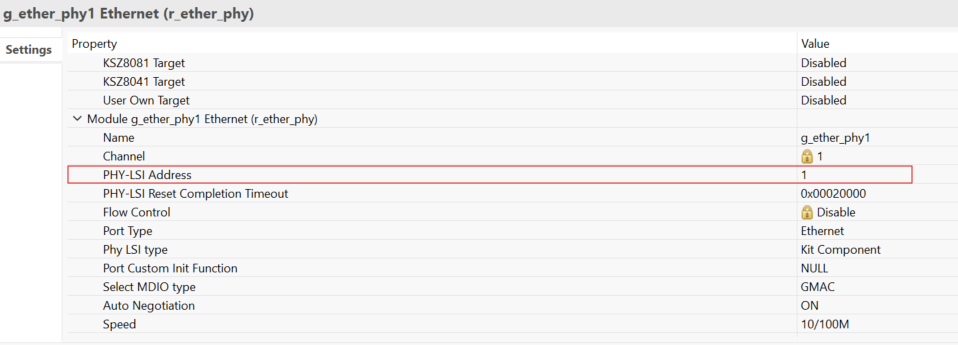
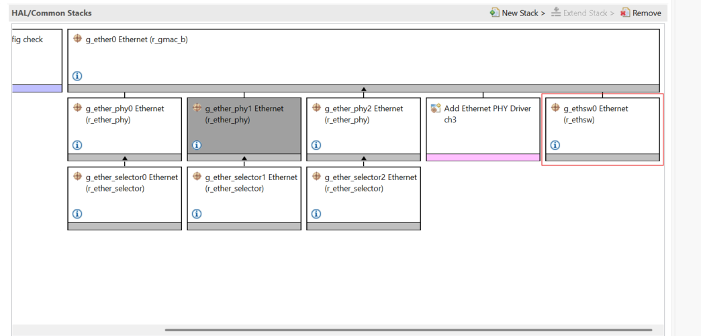
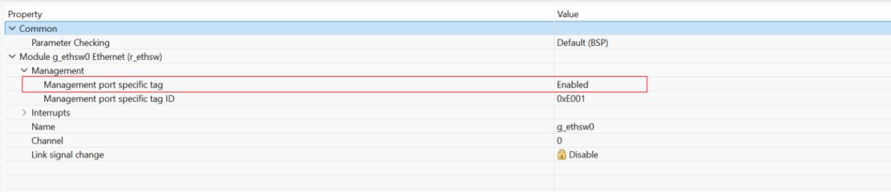

# Introduction
 
This example project demonstrates Ethernet functionality using the GMAC driver on RZ/N2H based on Renesas FSP.
The program initializes three Ethernet ports (ETH0, ETH1, and ETH2) with predefined MAC and IP addresses and waits for communication from a host PC.
Once initialized, the board listens for ARP and ICMP echo requests from a host PC connected to each Ethernet port.
When an ARP request is received, the board responds with its MAC address.
When a ping request is received, the board sends an ICMP echo reply back to the sender.
This allows users to verify Ethernet communication from the host PC using basic ping commands.

Please refer to the Example Project Usage Guide for general information on example projects and [readme.txt](./readme.txt) for specifics of operation.

## Required Resources
To build and run the Ethernet example project, the following resources are needed.

### Hardware
* 1x RZ/N2H Evaluation board
* 3x Ethernet Cables

Refer to [readme.txt](./readme.txt) for information on how to connect the hardware.

### Software
1. Refer to the software required section in Example Project Usage Guide

## Related Collateral References
The following documents can be referred to for enhancing your understanding of 
the operation of this example project:
- [FSP User Manual on GitHub](https://renesas.github.io/rz-fsp/)

# Project Notes

## FSP Modules Used
List of important modules that are used in this example project. Refer to the FSP User Manual for further details on each module listed below.

| Module Name | Usage | Searchable Keyword  |
|-------------|-----------------------------------------------|-----------------------------------------------|
|Ethernet | Driver for the Ethernet peripheral to demonstrate ARP and ICMP Echo Response (Ping) functionalities using multiple GMAC interfaces. | gmac|

The table below lists the FSP provided API used at the application layer by this example project.

| API Name    | Usage                                                                          |
|-------------|--------------------------------------------------------------------------------|
| R_GMAC_B_Open | This API is used to initialize the Ethernet peripheral, including ETHERC, EDMAC, and PHY, and start PHY auto-negotiation to establish a link. |
| R_GMAC_B_Write | This API is used to transmit Ethernet frame. Transmits data from the location specified by the pointer to the transmit buffer, with the data size equal to the specified frame length. |
| R_GMAC_B_Read | This API is used to receive an Ethernet frame by receiving data to the location specified by the pointer to the receive buffer. |
| R_GMAC_B_Close | This API is used to close the Ethernet channel by disabling interrupts, releasing hardware locks, and powering down the peripheral. |
| R_GMAC_B_LinkProcess | This API is used to handle link up/down status and magic packet detection by executing necessary PHY interface processing.  |

## Verifying operation
1. Import, generate and build Ethernet EP in e2studio.
   Before running the example project, make sure hardware connections are done.
2. Download Ethernet EP to one Renesas RZ MPU Evaluation kit and run the project.
3. On the host PC, configure each Ethernet port with a static IP address in the same subnet as the board's default IPs (e.g., 192.168.10.1, 192.168.20.1, 192.168.30.1).
4. Now open Jlink RTT Viewer and connect to RZ MPU board.
5. User can observe the link-up status of all Ethernet ports via messages displayed on J-Link RTT Viewer.
6. Also user can open the command prompt and perform ping operations to each board IP address (192.168.10.100, 192.168.20.100, 192.168.30.100).
7. The board responds to ARP and ICMP Echo requests, allowing users to verify Ethernet functionality by checking successful ping replies.
   
   Below images showcases the Ethernet output on JLinkRTT_Viewer and Command Prompt:

   

   

   

## When using the ETH1 and ETH2 connectors on the board when creating a new project
In this sample software, ETH1 and ETH2 are already enabled, so the following steps are unnecessary.

When creating a new project, only ETH0 is enabled, so you need to add ETH1 and ETH2 PHYs from FSP Configurator.

In the figure below, the red frame is ETH1 and the blue frame is ETH2.

   

(1) Click the PHY you want to add and select "New"-"Ethernet Driver on r_ether_phy"

(2) On the "Properties" tab of PHY, set "PHY-LSI Address" in the red frame in the figure below according to the board to be used.

   

For RZ/N2H Evaluation board, set as follows depending on the board version.

|  |  | ETH0 | ETH1 | ETH2 |
|---|---| --- | --- | --- |
| RZ/N2H_EVK | PHY-LSI Address | 0 | 1 | 2|

(3) Click "Generate Project Content" to execute code generation

(4) Rebuild from e2studio

## When enabling the management tag function of ETHSW when creating a new project
Since the management tag function of ETHSW is disabled when a new project is created, it is necessary to enable the management tag function from the FSP Configurator.

(1) Click ETHSW in the red frame below to select

   

(2) Set "Management port specific tag" to "Enabled" in the "Properties" tab of ETHSW

   