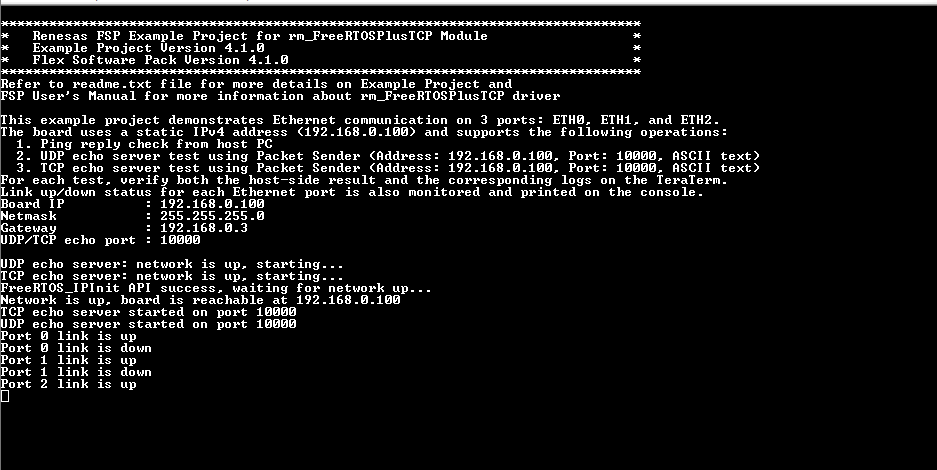
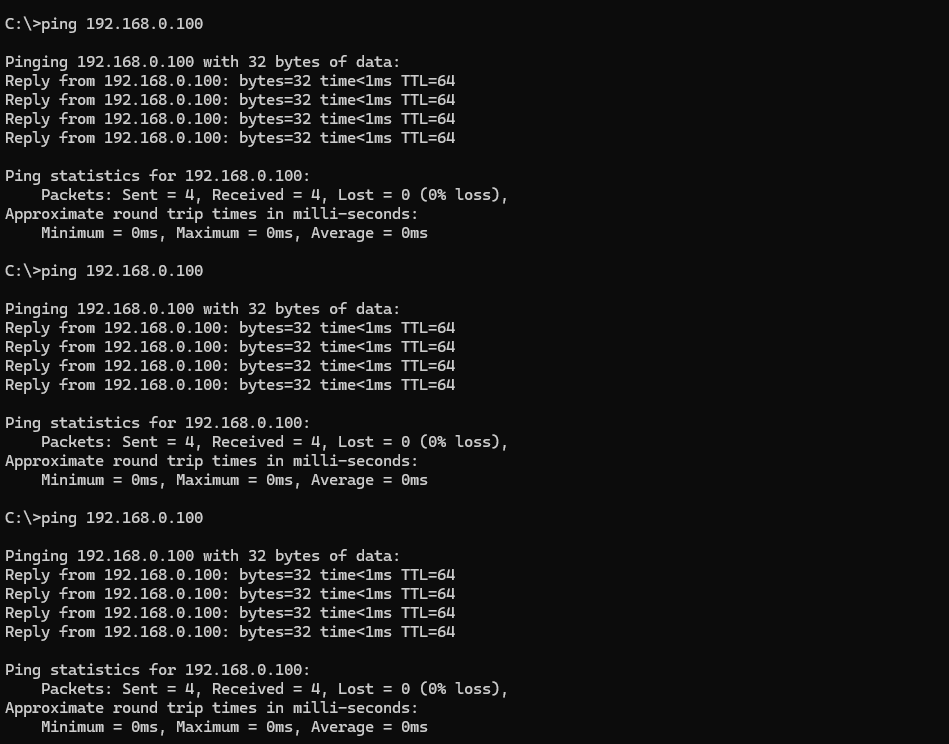
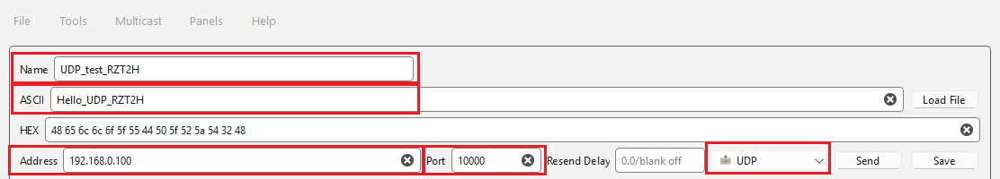
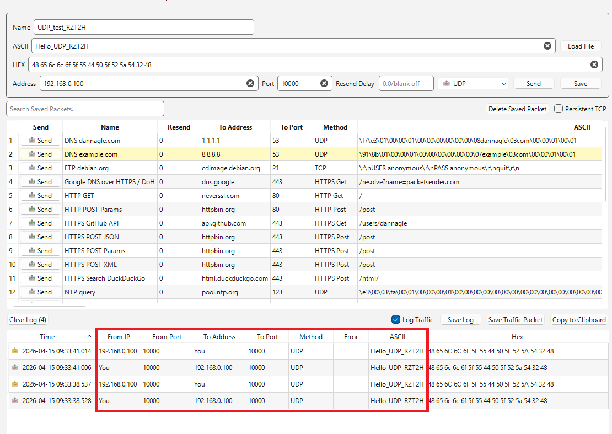
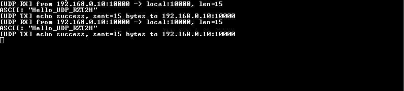
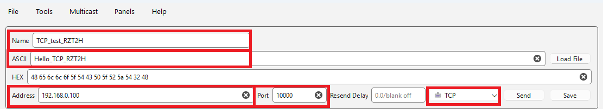
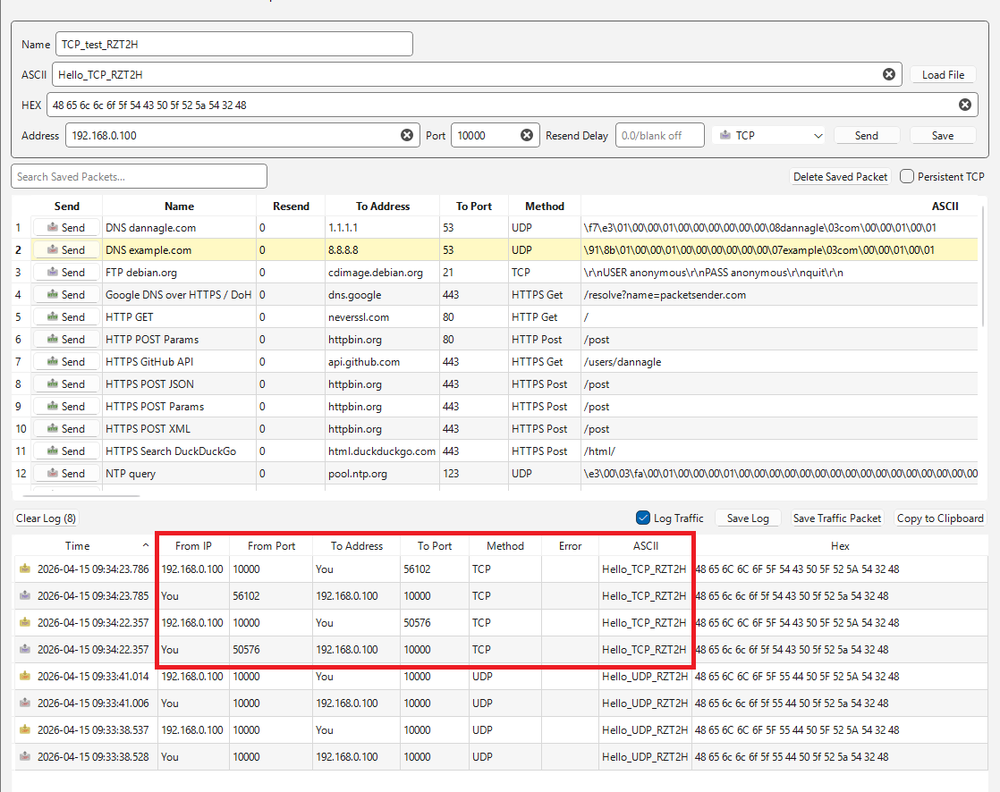
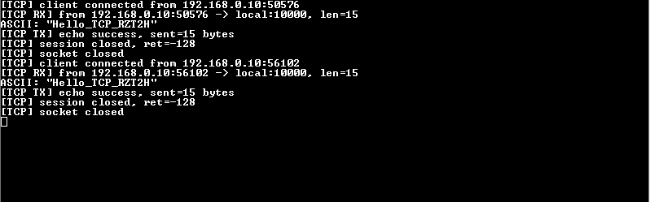
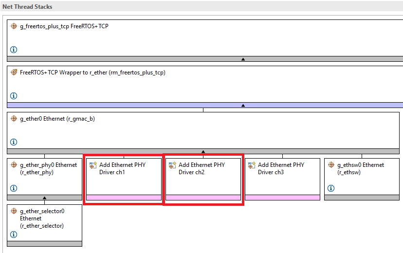
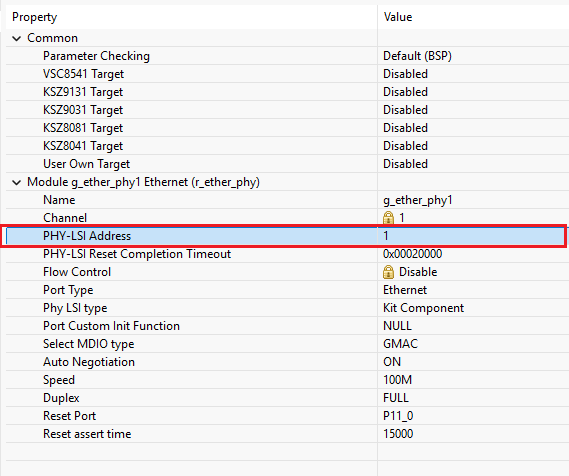

# Introduction
 
This example project demonstrates Ethernet communication on RZ/T2H using FreeRTOS+TCP based on Renesas FSP.
The application monitors three Ethernet ports (ETH0, ETH1, and ETH2), uses a static IPv4 address of 192.168.0.100,
and waits for communication from a host PC. Once the network is up, the board supports basic ping reply verification
and runs both UDP and TCP echo servers on port 10000. A host PC can be connected to each Ethernet port
to verify connectivity, packet exchange, and echo functionality, while the application also reports link up/down events
and network status on the console.

Please refer to the Example Project Usage Guide for general information on example projects and [readme.txt](./readme.txt) for specifics of operation.

## Required Resources
To build and run the FreeRTOSplusTCP example project, the following resources are needed.

### Hardware
RZ supported boards: RZ/T2H-EVK.
* 1 x RZ board.
* 1 x USB Type-C cable.
* 1 x USB Type-A to micro USB cable.
* 1 x Ethernet cable.

Refer to [readme.txt](./readme.txt) for information on how to connect the hardware.

### Software
1. Refer to the software required section in Example Project Usage Guide

## Related Collateral References
The following documents can be referred to for enhancing your understanding of
the operation of this example project:
- [FSP User Manual on GitHub](https://renesas.github.io/rz-fsp/)

# Project Notes

## FSP Modules Used
List of important modules that are used in this example project. Refer to the FSP User Manual for further details on each module listed below.

| Module Name  | Usage | Searchable Keyword |
|--------------|-------|--------------------|
| Ethernet     | Driver for Ethernet communication on 3 ports and link status monitoring. | gmac |
| FreeRTOS+TCP | TCP/IP stack for static IP initialization, ping reply, UDP echo, and TCP echo functionality. | FreeRTOS_IP |

The table below lists the FSP provided API used at the application layer by this example project.

| API Name    | Usage                                                                          |
|-------------|--------------------------------------------------------------------------------|
| FreeRTOS_IPInit | This API is used to provide backward-compatibility with FreeRTOS+TCP.      |
| R_GMAC_B_GetLinkStatus | This API is used to get link status of specificed port.             |

## Module Configuration Notes
This section describes FSP Configurator properties of Net Thread stack, which are important or different than those selected by default.

|   Module Property Path and Identifier   |   Default Value   |   Used Value   |   Reason   |
| :-------------------------------------: | :---------------: | :------------: | :--------: |
| g_ether_phy0 Ethernet (r_ether_phy) > Properties > Settings > Property > Module g_ether_phy0 Ethernet (r_ether_phy) > Speed | 10/100/1000M | 100M | The PHY speed is fixed to 100 Mbps to match the MII interface limitation and ensure stable operation on ETH0. |
| g_ether_phy0 Ethernet (r_ether_phy) > g_ether_selector0 Ethernet (r_ether_selector) > Properties > Setting > Property > Module g_ether_phy0 Ethernet (r_ether_selector) > Interface Type | RGMII | MII | ETH0 is configured to use the MII interface to represent a standard 10/100 Mbps Ethernet use case. |
| g_ether_phy1 Ethernet (r_ether_phy) > Properties > Settings > Property > Module g_ether_phy1 Ethernet (r_ether_phy) > PHY-LSI Address | 0 | 1 | The PHY address is set to match the physical hardware connection of Ethernet Port 1 on the board. |
| g_ether_phy1 Ethernet (r_ether_phy) > Properties > Settings > Property > Module g_ether_phy1 Ethernet (r_ether_phy) > Speed | 10/100/1000M | 100M | The PHY speed is limited to 100 Mbps to comply with the MII interface used by ETH1. |
| g_ether_phy1 Ethernet (r_ether_phy) > g_ether_selector1 Ethernet (r_ether_selector) > Properties > Setting > Property > Module g_ether_phy1 Ethernet (r_ether_selector) > Interface Type | RGMII | MII | ETH1 is configured as an MII port to provide an additional 10/100 Mbps Ethernet interface for redundancy or secondary network use cases. |
| g_ether_phy2 Ethernet (r_ether_phy) > Properties > Settings > Property > Module g_ether_phy2 Ethernet (r_ether_phy) > PHY-LSI Address | 0 | 2 | The PHY address is configured to correctly correspond to the physical hardware connection of Ethernet Port 2 on the board. |

## Verifying operation
1. Import, generate, and build this example project in e2studio.
   Before running the example project, make sure the hardware connections are done.
2. Download FreeRTOSplusTCP EP to one Renesas RZ MPU Evaluation Kit and run the project.
3. On the host PC, configure one Ethernet interface with a static IP address in the same subnet as the board's default IP (e.g., 192.168.0.1).
4. Now open Tera Term and connect to RZ MPU board.
5. Connect the host PC to one Ethernet port on the board and confirm the corresponding link up/down message is displayed on the console. The application monitors three Ethernet ports: ETH0, ETH1, and ETH2.

### Ping verification from host PC
6. From the host PC, perform a ping test to `192.168.0.100` and confirm the board is reachable.
7. Send a UDP packet to `192.168.0.100:10000` and confirm the board echoes the same payload back.
8. Open a TCP connection to `192.168.0.100:10000`, send a payload, and confirm the board echoes the same payload back.
9. Repeat the same connection and verification steps by moving the Ethernet cable to ETH0, ETH1, and ETH2 one at a time to confirm operation on all monitored ports.

   The images below showcase the FreeRTOSplusTCP output on Tera Term and Command Prompt:

   
 
   

### UDP packet verification
10. Download the Packet Sender Software (https://packetsender.com/download#show) and install it on the Host PC.

11. Configure a UDP packet with the following settings:
   - Protocol: UDP
   - Address: `192.168.0.100`
   - Port: `10000`
   - Payload: any ASCII text (for example, Hello_UDP_RZT2H)

   
	
12. Send the UDP packet to the board.
13. Verify on the host PC that the same payload is echoed back from the board.

   

14. Verify on Tera Term that the application displays UDP receive/transmit logs, including the sender IP address, payload length, and echoed response status.

   

### TCP packet verification
15. Configure a TCP packet with the following settings:
   - Protocol: TCP
   - Address: `192.168.0.100`
   - Port: `10000`
   - Payload: any ASCII text (for example, Hello_TCP_RZT2H)

   
	
16. Send the TCP packet to the board.
17. Verify on the host PC that the same payload is echoed back from the board.

   

18. Verify on Tera Term that the application displays TCP receive/transmit logs, including the sender IP address, payload length, echoed response status and Client disconnection.

   

## When using the ETH1 and ETH2 connectors on the board when creating a new project
In this sample software, ETH1 and ETH2 are already enabled, so the following steps are unnecessary.

When creating a new project, only ETH0 is enabled, so you need to add ETH1 and ETH2 PHYs from FSP Configurator.

In the figure below:

   

(1) Click the PHY you want to add and select "New"-"Ethernet Driver on r_ether_phy"

(2) On the "Properties" tab of PHY, set "PHY-LSI Address" in the red frame in the figure below according to the board to be used.

   

(3) Click "Generate Project Content" to execute code generation

(4) Rebuild from e2studio