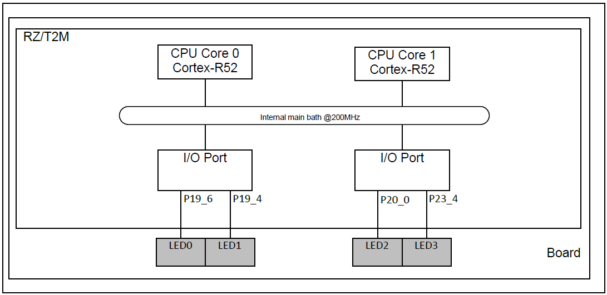
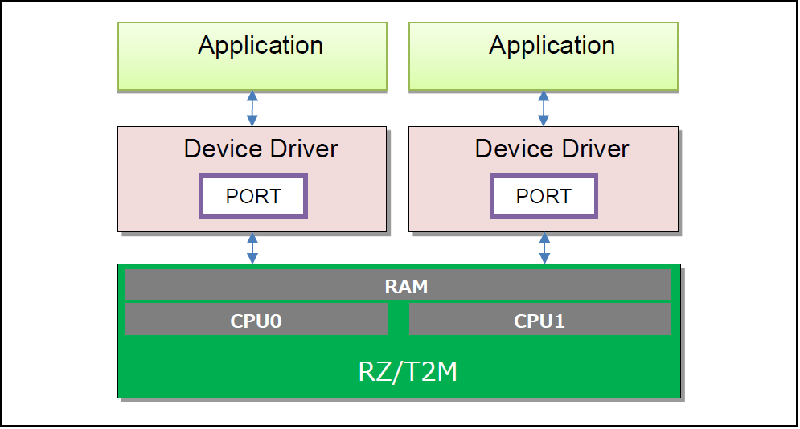
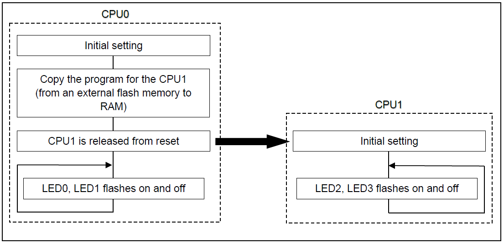
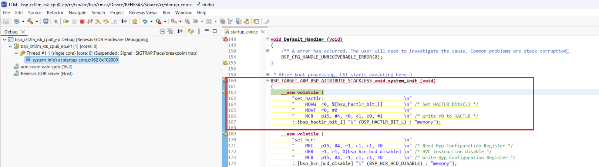
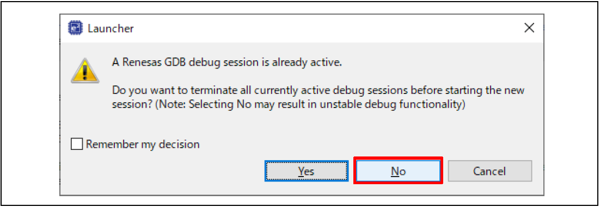
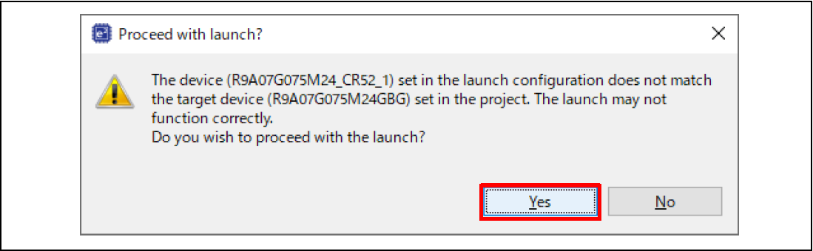
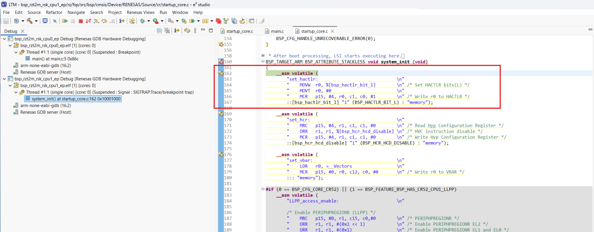

# Introduction
 
This example project demonstrates basic functionalities of BSP dual cores of CPU0 and CPU1.
After the power is turned on, the program on the CPU0 side makes initial settings,
copies the program code for CPU1 from the external flash memory to the RAM (the RAM execution without flash memory version does not copy). Then, the program releases the reset of CPU1.The program on the CPU1 side performs initial settings after software reset is released, and toggles on-board LED2 and LED3. Result is displayed on the JLinkRTTViewer.

Please refer to the Example Project Usage Guide for general information on example projects and [readme.txt](./readme.txt) for specifics of operation.

## Required Resources
To build and run the BSP Dual example project, the following resources are needed.

### Hardware
* 1x Renesas Starter Kit+ for RZ/T2M
* 1x USB A to USB Micro B Cable

Hardware Configuration
   

Refer to [readme.txt](./readme.txt) for information on how to connect the hardware.

### Software
1. Refer to the software required section in Example Project Usage Guide

## Related Collateral References
The following documents can be referred to for enhancing your understanding of 
the operation of this example project:
- [FSP User Manual on GitHub](https://renesas.github.io/rz-fsp/)

# Project Notes

## System Level Block Diagram
High level block diagram

## Operation Overview
Dual Core Operation diagram

## FSP Modules Used
List of important modules that are used in this example project. Refer to the FSP User Manual for further details on each module listed below.

| Module Name | Usage | Searchable Keyword  |
|-------------|-----------------------------------------------|-----------------------------------------------|
|I/O Ports | Driver for the I/O Ports peripheral on RZ microprocessors | io_port|

## Module Configuration Notes
This section describes FSP Configurator properties which are important or different than those selected by default. 

|   Module Property Path and Identifier   |   Default Value   |   Used Value   |   Reason   |
| :-------------------------------------: | :---------------: | :------------: | :--------: |
|                  -                       |      -             |      -          |       -     |

The table below lists the FSP provided API used at the application layer by this example project.

| API Name    | Usage                                                                          |
|-------------|--------------------------------------------------------------------------------|
| R_BSP_PinClear | This API is used to clear the output level of the pin in the specified region. |
| R_BSP_PinToggle | This API is used to toggle the output level of the pin in the specified region  |
| R_BSP_SoftwareDelay | This API is used to wait any time.  |

## Verifying operation

This section describes the procedure for debugging this example program in each development environment.
  
1. Import, generate and build BSP CPU0 EP in e2studio.
2. Import, generate and build BSP CPU1 EP in e2studio.
Before running the example project, make sure hardware connections are done.
1. Download BSP CPU0 EP to one Renesas RZ MPU Evaluation kit. After starting to debug the CPU0 project, the program breaks at the first code of "system_init" in “startup_core.c”.
   
2. Click the [Resume] button to restart debugging. In the CPU0 project, the program breaks at "hal_entry()" in “main.c”.
3. Right-click the CPU1 project to be debugged in the [Project Explorer] view. Select [Debug As] > [Renesas DBG Hardware Debugging].
A message "A Renesas GDB debug session is already active" will be displayed, so select [No].
   
1. A message "Proceed with launch?" will be displayed, so select [Yes].
   
2. In the [Debug] view, you can check the threads of the CPU0 and CPU1 projects. Click "system_init() at startup.c:X 0xXXXXXXXX" in Thread of CPU1 to switch to the debug screen of CPU1.
In the CPU1 project, the program breaks at the first code of "system_init" in “startup_core.c”.
   
1. Click the [Resume] button to restart debugging. In the CPU1 project, the program breaks at "hal_entry()" in “main.c”.
2. Now open Jlink RTT Viewer and connect to RZ MPU board, specify target CPU0 or CPU1 and enter corresponding RTT address that mentioned in readme document.
3.   Click the [Resume] button again on CPU1 side to resume debugging. After restarting debugging, LED2 and LED3 on the RSK board start blinking.
4.   For RAM execution, click "main() at main.c:X 0xXXXXXXXX" in Thread in the CPU0 project in the [Debug] view to switch to the debug screen for CPU0. Click the [Resume] button again on CPU0 side to resume debugging. After restarting debugging, LED0 and LED1 on the RSK board start blinking.
5.   User can see status is shown in the JLinkRTT Viewer.

- Note:
  - 1. Do not press the reset button on the RSK board during debugging.
  - 2. In NOR flash boot mode and xSPI0 boot mode, debugging may fail if data is written to the external flash memory. In that case, erase the external flash memory before debugging.