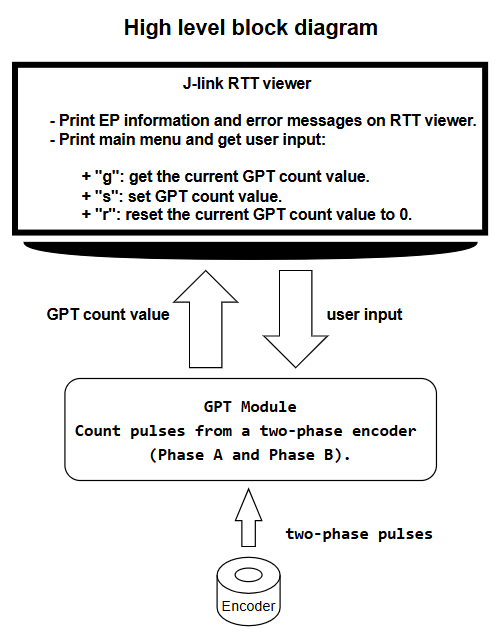
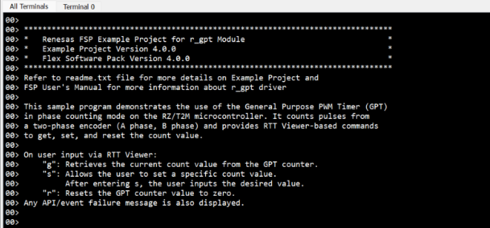
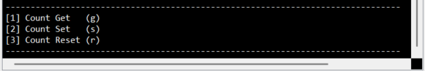
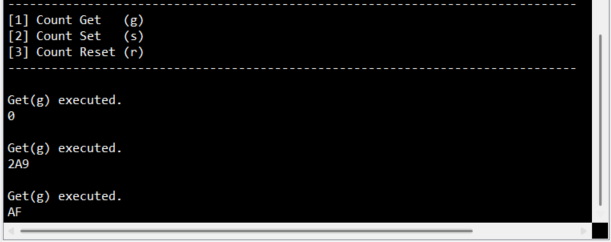
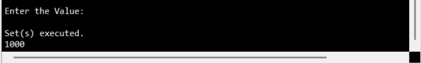
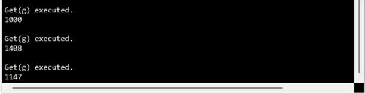
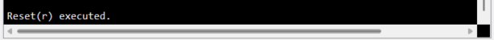
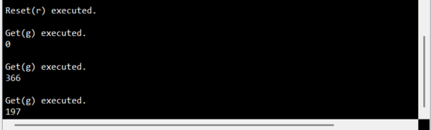
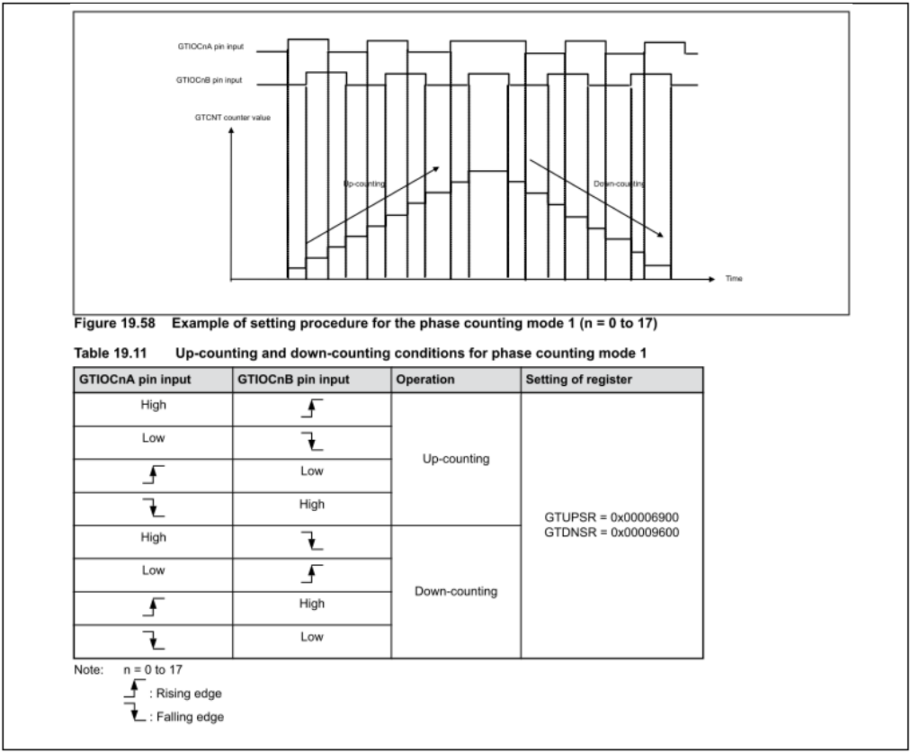

# Introduction

This example project demonstrates basic functionalities of GPT drive in phase counting mode 1 on RZ/T2M based on Renesas FSP.
It counts pulses from a two-phase encoder (A phase, B phase) and provides RTT Viewer-based commands to get, set, and reset the count value.
when user input "g": Retrieves the current count value from the GPT counter.
when user input "s": Allows the user to set a specific count value. After entering s, the user inputs the desired value.
when user input "r": Resets the GPT counter value to zero.
Result and GPT status is displayed on the JLinkRTTViewer.

Please refer to the Example Project Usage Guide for general information on example projects and [readme.txt](./readme.txt) for specifics of operation.

## Required Resources
To build and run the GPT example project, the following resources are needed.

### Hardware
* 1x Renesas Starter Kit+ for RZ/T2M
* 1x MB057GA140 Encoder(Motor)

Refer to [readme.txt](./readme.txt) for information on how to connect the hardware.

### Software
1. Refer to the software required section in Example Project Usage Guide

## Related Collateral References
The following documents can be referred to for enhancing your understanding of 
the operation of this example project:
- [FSP User Manual on GitHub](https://renesas.github.io/rz-fsp/)

# Project Notes

## System Level Block Diagram

## FSP Modules Used
List of important modules that are used in this example project. Refer to the FSP User Manual for further details on each module listed below.

|    Module Name   |                               Usage                                  | Searchable Keyword  |
|------------------|----------------------------------------------------------------------|---------------------|
|General PWM Timer | Driver to counts pulses from a two-phase encoder (A phase, B phase)  |         gpt         |

The table below lists the FSP provided API used at the application layer by this example project.

|      API Name     |                                    Usage                                       |
|-------------------|--------------------------------------------------------------------------------|
| R_GPT_Open        | This API is used to initialize the GPT driver                                  |
| R_GPT_Start       | This API is used to start the timer to count two-phase encoder                 |
| R_GPT_StatusGet   | This API is used to get current timer status and store it in provided pointer  |
| R_GPT_Stop        | This API is used to stop timer                                                |
| R_GPT_CounterSet  | This API is used to set value for the timer counter                            |
| R_GPT_Reset       | This API is used to reset the counter value to 0                              |

## Verifying operation
1. Import, generate and build GPT EP in e2studio.
   Before running the example project, make sure hardware connections are done.
2. Download GPT EP to one Renesas RZ MPU Evaluation kit and run the project.
3. Now open JLink RTT Viewer and connect to RZ MPU board.
4. User can perform Menu option operations and check corresponding results JLinkRTTViewer.
5. Verify phase count direction by rotating the encoder shaft:
   - Input `r` to reset the counter to 0.
   - Input `g` and confirm the current count value is `0`.
   - Rotate the encoder shaft clockwise, then input `g`.
     The count value should increase (become positive).
   - From the current position, rotate the encoder shaft counter-clockwise, then input `g`.
     The count value should decrease. It may remain positive if the rotation does not pass the zero reference.
   - To observe a negative value, either:
     - keep rotating counter-clockwise until the count passes below 0, or
     - input `r` at the current position (set a new zero reference) and then rotate counter-clockwise; the next `g` should show a negative count.

   Below images showcases the GPT output on JLinkRTTViewer:

+ Banner Info:

   

+ Menu:

   

 
+ Retrieve the counter value from the initial state of the encoder then rotations clockwise and counterclockwise:

   

+ Set the value for counter:

    1000" width="500"/>

+ Retrieve the new counter value encoder then rotations clockwise and counterclockwise:

   

+ Reset the value for counter:

   

+ Retrieve the reset counter value encoder then rotations clockwise and counterclockwise:

   

## About Phase counting mode 1

   The operation of the phase counting mode 1 is shown below.

   