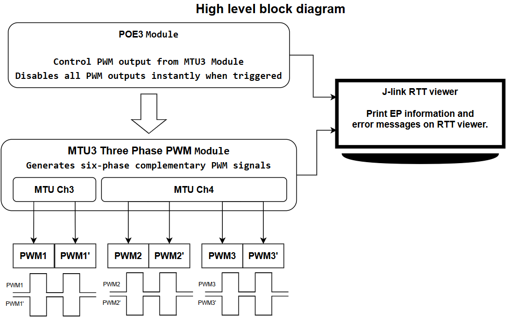
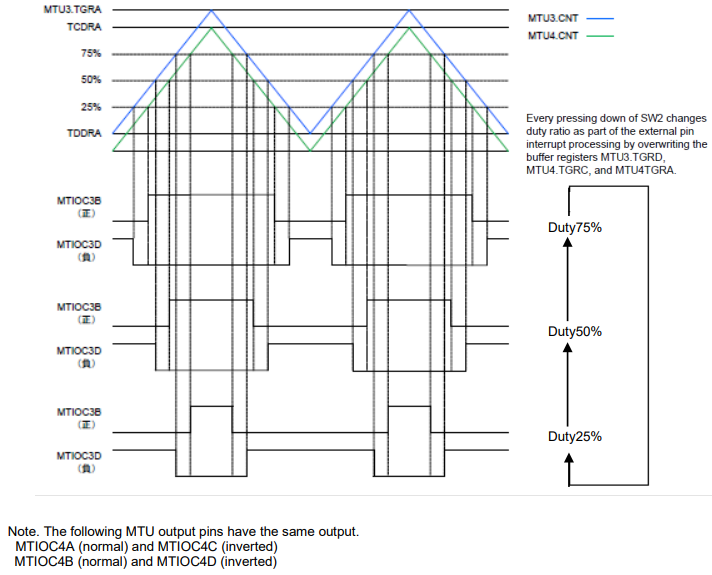
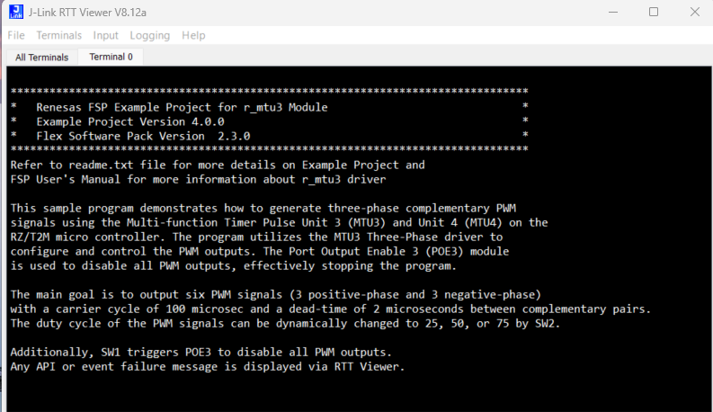
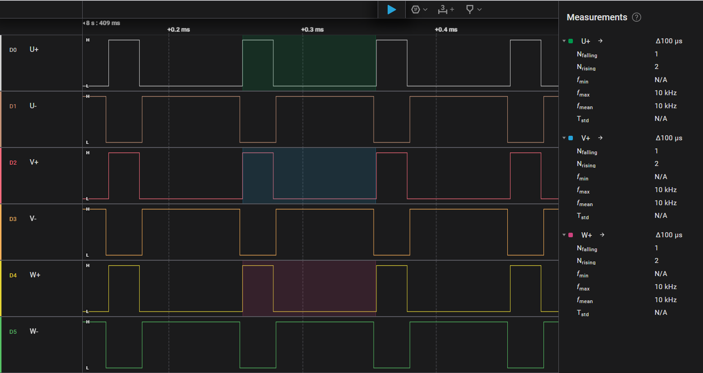
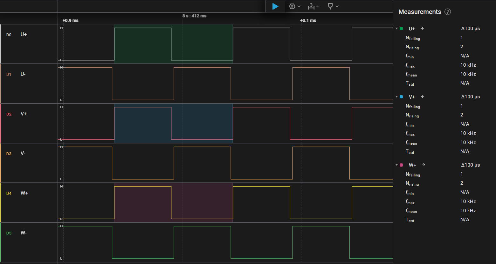
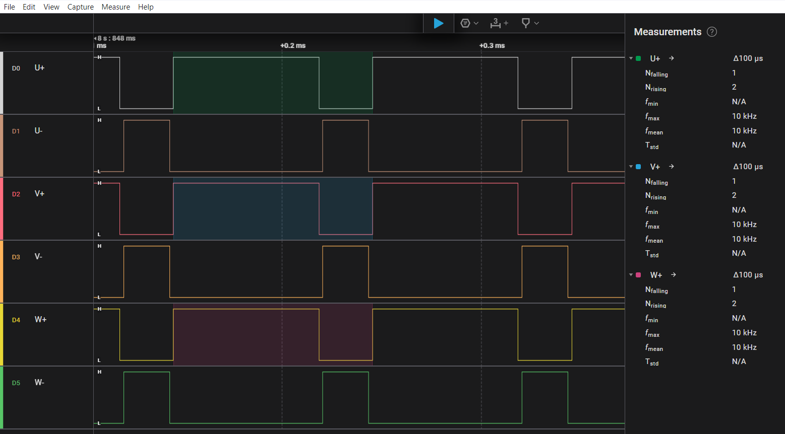
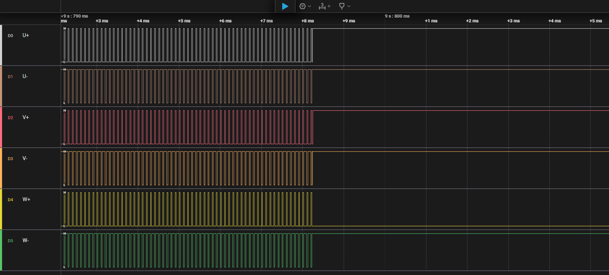

# Introduction
 
This example project showcases the generation of three-phase complementary PWM (Pulse Width Modulation) signals using the Multi-function Timer Pulse Units MTU3 and MTU4 on the Renesas RZ/T2M microcontroller. The system leverages the MTU3 Three-Phase PWM driver to configure and control six synchronized PWM outputs—three for the positive phase and three for the complementary (negative) phase.

The PWM signals operate with a carrier cycle of 100 μs and incorporate a 2 μs dead time between each complementary pair to prevent shoot-through conditions. The duty cycle of the PWM outputs can be dynamically adjusted to 25%, 50%, or 75% via SW2. Additionally, pressing SW1 activates the Port Output Enable 3 (POE3) module, which immediately disables all PWM outputs, effectively halting the system.

Any API or event-related errors are reported through the RTT Viewer, providing real-time feedback for debugging and monitoring.

Please refer to the Example Project Usage Guide for general information on example projects and [readme.txt](./readme.txt) for specifics of operation.

## Required Resources
To build and run the MTU3 example project, the following resources are needed.

### Hardware
* 1x Renesas Starter Kit+ for RZ/T2M

Refer to [readme.txt](./readme.txt) for information on how to setting the hardware.

### Software
1. Refer to the software required section in Example Project Usage Guide

## Related Collateral References
The following documents can be referred to for enhancing your understanding of 
the operation of this example project:
- [FSP User Manual on GitHub](https://renesas.github.io/rz-fsp/)

# Project Notes

## High Level Block Diagram

## FSP Modules Used
List of important modules that are used in this example project. Refer to the FSP User Manual for further details on each module listed below.

|    Module Name                   |                               Usage                                        |  Searchable Keyword  |
|----------------------------------|----------------------------------------------------------------------------|----------------------|
|Port Output Enable 3 for MTU3     | Disables all PWM outputs instantly for safe shutdown when triggered        |         poe3         |
|MTU3 Three Phase PWM              | Controls three-phase complementary PWM output with adjustable duty cycles  |  r_mtu3_three_phase  |

The table below lists the FSP provided API used at the application layer by this example project.

|      API Name                   |                                    Usage                                       |
|---------------------------------|--------------------------------------------------------------------------------|
| R_MTU3_THREE_PHASE_Open         | This API is used to initialize and configures the three-phase PWM driver       |
| R_MTU3_THREE_PHASE_DutyCycleSet | This API is used to set the duty cycle values for U, V, and W PWM channels     |
| R_MTU3_THREE_PHASE_Start        | This API is used to start the PWM signal generation                            |
| R_MTU3_THREE_PHASE_Stop         | This API is used to stop the PWM signal generation                             |
| R_MTU3_THREE_PHASE_Close        | This API is used to release resources and closes the PWM driver                |
| R_POE3_Open                     | This API is used to initialize the POE3 module for PWM output control          |
| R_POE3_OutputDisable            | This API is used to immediately disables all PWM outputs for safe shutdown     |
| R_POE3_Close                    | This API is used to release resources and closes the POE3 module               |

## Timing Diagram

The table below shows the functional overview and timing diagram of this example project.

|    Function     |                                      Description                                     |
|-----------------|--------------------------------------------------------------------------------------|
| Channel         |  Channel 3 (MTU3), channel 4 (MTU4)                                                  |
| PWM output      |  Three phases for positive and negative (in total of 6), cycle of carrier (100 μs),  |
| Operating mode  |  Complementary PWM mode 1 (transferred at crest)                                     |
| Clock           |  PCLKH/4 (= 50.0 MHz), rising edge                                                   |
| Duty ratio      |  25%, 50%, and 75% common to all phases                                              |

   

## Verifying operation
1. Import, generate and build MTU3 EP in e2studio.
   Before running the example project, make sure hardware connections are done.
2. Download MTU3 EP to one Renesas RZ MPU Evaluation kit and run the project.
3. Now open JLinkRTTViewer and connect to RZ MPU board.
4. User can perform Menu option operations and check corresponding results JLinkRTTViewer.
   
   Below images showcases the MTU3 output on JLinkRTT_Viewer:

   

   Below images showcases the MTU3 output capture by Logic Analyzer:
 
   +  PWM signals U, V, W and their complementary outputs at 25% duty cycle:
      
      

   +  PWM signals U, V, W and their complementary outputs at 50% duty cycle:

      

   +  PWM signals U, V, W and their complementary outputs at 75% duty cycle:

      

   +  PWM signals Disables with SW1:

      
